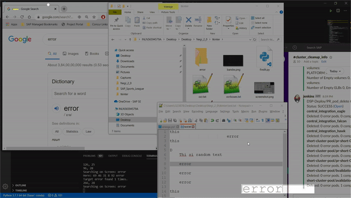

# centre
Acronym for  "searCh tExt iN mulTiple scREens". 


When I am using multiple monitors and a lot of windows are open, I want to search a text. I know that text is available in screens which are open, but Alas!, there is no common search option to search in all the windows in all the screens.

I wrote this utility to solve this problem.

## Getting Started


### Prerequisites

What things you need to install the software and how to install them

```
python 3.0 
```

### Installing

Go to root folder, find requirements.txt and install the requirements.

```
pip install requirements.txt
```

I am using pytesseract for OCR. After pip install you'll need to [download](https://tesseract-ocr.github.io/tessdoc/Home.html) their binary based on your platform.

### Usage

`python findIt.py` will create a transparent canvas on top of all available windows. You can arrange the windows under it manually.

Type the text you want to search in bottom right corner of the frame.

Press `Ctrl + F` to toggle searchbar

Press `F11` to take the screenshot

Press `Esc` to toggle full-screen


## Built With

* [tkinter](https://docs.python.org/3/library/tkinter.html) - Tk GUI Toolkit
* [pyscreenshot](https://pypi.org/project/pyscreenshot/) - To capture the screen
* [pytesseract](https://pypi.org/project/pytesseract/) - Wrapper for [Google’s Tesseract-OCR Engine](https://github.com/tesseract-ocr/tesseract)

## Contributing

Will be open to contribute soon.

## Versioning

So far this is just a trial version. Used as a POC.

## Authors

* **Anurag Negi** -  [blissful-coder](https://github.com/blissful-coder)


## License

This project is licensed under the MIT License - see the [LICENSE.md](LICENSE.md) file for details.

## Acknowledgments

* [stackoverflow] (https://stackoverflow.com/)
